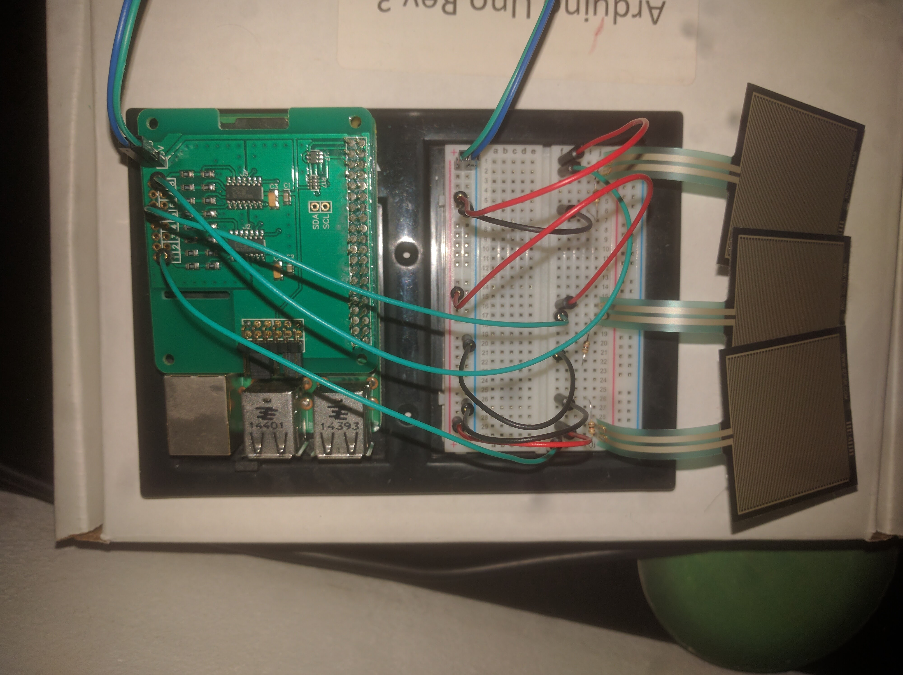

# Beerify Sensor
Code running on the beerify sensor board (Raspberry Pi 2B + ADC Pi Plus + 3 FSRs).

## Configure the Raspberry Pi 2B
0) Mount the board and wire the sensors
1) Download Raspbian Jessie Lite (We don't need any Libreoffice,...)
2) Copy the image to the SD card (https://www.raspberrypi.org/documentation/installation/installing-images/linux.md)
3) Install a desktop manager if needed (https://www.raspberrypi.org/forums/viewtopic.php?f=66&t=133691)
4) Setup I2C on the Rasperry (https://www.abelectronics.co.uk/i2c-raspbian-wheezy/info.aspx)
5) Install git
6) Clone this repo and start the script

## Sensor wiring

